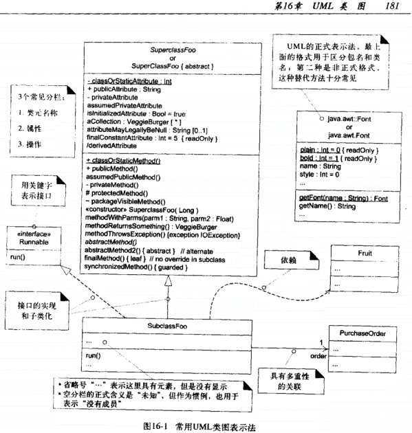

[作业要求](https://sysu-swsad.github.io/swad-guide/02-prject-team#3作业)

[提交页面](https://shimo.im/sheets/uBJjssYsbnAbcYaB/QBaT7)

## 1、简答题
- 用简短的语言给出对分析、设计的理解。
  - 分析： 根据客户的要求，清楚了解客户需求中的产品功能、特性、性能、界面和具体规格等，分析确定软件产品所能达到的目标。-- Do the right thing.
  - 设计： 根据需求分析的结果，考虑如何在逻辑上实现所定义的产品功能、特性。是概念上的解决方案。-- Do the thing right.
 
- 用一句话描述面向对象的分析与设计的优势。
  - 优势：更可理解、可靠、可变的建模方式能够灵活应对需求、市场等的变化。
 
- 简述 UML（统一建模语言）的作用。考试考哪些图？
  - 作用：使得面向对象的分析和设计的结果可视化。
  - 考试考：
    - 用例图：用户角度：功能、执行者  
    - 静态图：系统静态结构 
    - 类图：概念及关系 
    - 对象图：某种状态或时间段内，系统中活跃的对象及其关系 
    - 包图：描述系统的分解结构  
    - 行为图：系统的动态行为 
    - 交互图：描述对象间的消息传递 
    - 顺序图：强调对象间消息发送的时序 
    - 合作图：强调对象间的动态协作关系 
    - 状态图：对象的动态行为。状态-事件-状态迁移-响应动作 
    - 活动图：描述系统为完成某功能而执行的操作序列  
    - 实现图：描述系统的组成和分布状况 
    - 构件图：组成部件及其关系 
    - 部署图：物理体系结构及与软件单元的对应关系
 
- 从软件本质的角度，解释软件范围（需求）控制的可行性
  - 软件的本质对软件范围的要求： Fred Brooks 总结的四点特性：
    - complexity 复杂性： 软件复杂性源于软件系统中大量独特的交互部分。过大的软件范围会增加软件复杂程度，从而由更大的复杂性隐藏更多不容易发现的缺陷，因此加大了产品需要大量的额外和计划外的返工的可能，所以从质量和预算来看软件范围需要控制。 
    - conformity 一致性： 当软件范围超过控制的时候，很大概率上会导致前面完成的组件到项目后期才有发现不一致性，需要开发和集成可接受的组件来替换不能重用的组件。这需要计划外的资源分配（通常），并可能延迟项目完成。但反之用一致性来设计并控制软件范围能够给工期更大的保障。 
    - changeability 可变性:  因为软件是软件密集型系统中最具延展性（容易改变）的元素，所以它是最经常改变的元素。这在开发项目的后期阶段和系统维持期间尤其如此。然而由于软件的复杂性和一致性，软件系统的变动往往牵一发而动全身，所以软件的范围，软件的需求一定要减少变动，或者说这种变动要可控可预测，减少对系统的大改动。
    - invisibility 不可视性：  软件没有物理存在的特性需要软件工程师在各种抽象层面可视化它，如果软件的范围没有有效控制，抽象层面的构建将变得尤其艰难。
  - 由IEEE指出的软件工程的特点又包括：
    - _"Software requirements are prone to frequent change"_
    - _"In many cases, requirements allocated to software must be renegotiated and reprioritized"_
    - _"Small changes to software can have large negative effects（There are no small software changes)"_
   
  也就是说"软件需求容易频繁变化，在许多情况下，分配给软件的需求必须重新协商和重新排序，对软件的小改动会产生很大的负面影响（从来不会是小改动）”。
  而现实是，在多数情况下，客户与开发者能就项目的 20% 内容给出严格的需求约定，80% 的内容都是相对模糊的。因此尽管围绕客户目标，发现并满足客户感兴趣的内容很最关键，开发管理的时候产品设计与开发者有更大的话语权。作为开发管理人员必须在这80%中考虑软件的四个特性将需求，将软件产品的范围尽可能的明确控制。甚至是在必要的时候砍去连用户都不清晰的业务，对软件开发来说是有益的和可行的。

## 2、项目管理实践
看板使用练习（提交看板执行结果贴图，建议使用 Git project） 
使用截图工具（png格式输出），展现你团队的任务 Kanban
每个人的任务是明确的。必须一周后可以看到具体结果
每个人的任务是1-2项
至少包含一个团队活动任务
## UML绘图工具练习（提交贴图，必须使用 UMLet） 
请在 参考书2 或 教材 中选择一个类图（给出参考书页码图号）

)

[参考书2--《UML和模式应用》P181 图16-1](类图所在页.PNG)

[我建立的图]()

